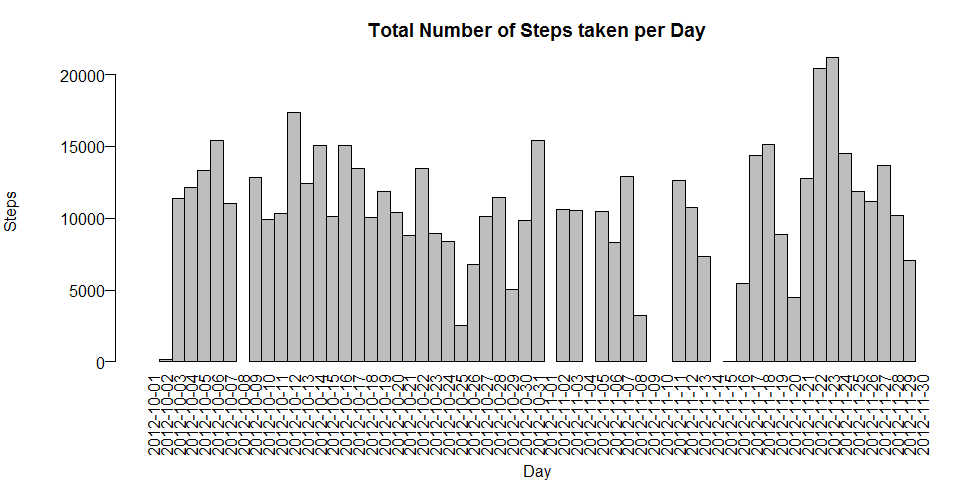
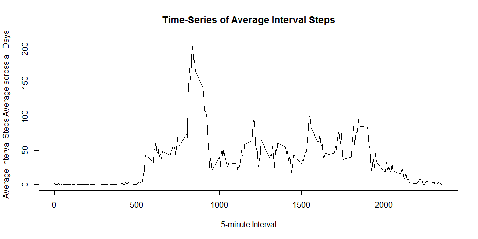
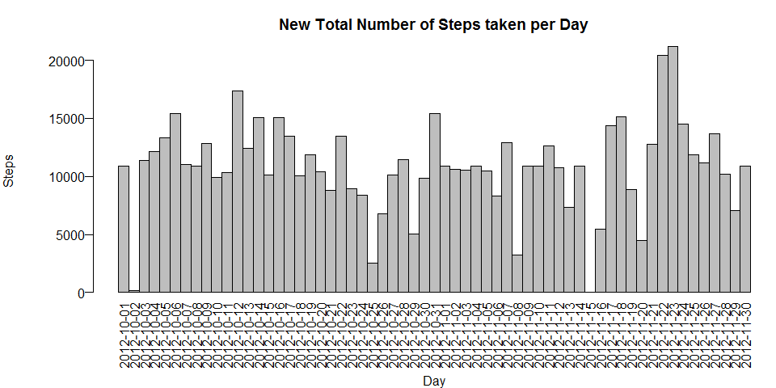
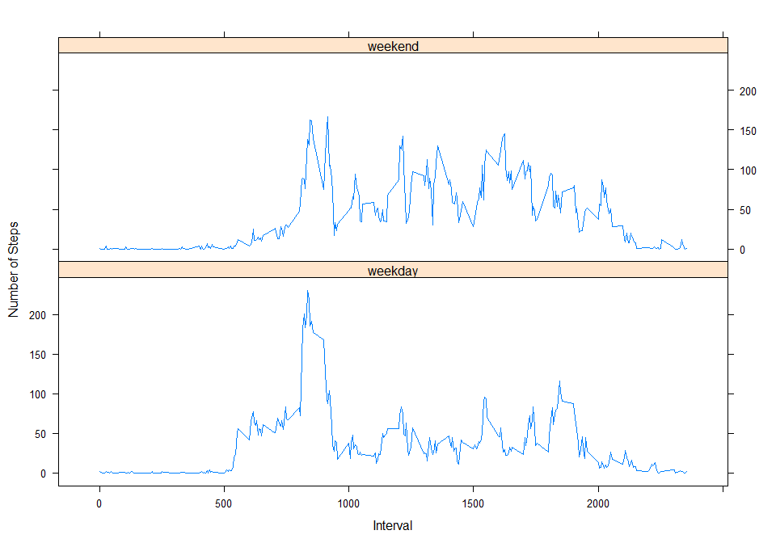

```r
knitr::opts_chunk$set(fig.path='./figure/')
```

### Reproducible Research: Peer Assessment 1

#### Introduction

It is now possible to collect a large amount of data about personal movement using activity monitoring devices such as a Fitbit, Nike Fuelband, or Jawbone 
Up. These type of devices are part of the "quantified self" movement - a group 
of enthusiasts who take measurements about themselves regularly to improve their health, to find patterns in their behavior, or because they are tech geeks. But these data remain under-utilized both because the raw data are hard to obtain 
and there is a lack of statistical methods and software for processing and interpreting the data.

This assignment makes use of data from a personal activity monitoring device. This device collects data at 5 minute intervals through out the day. The data consists of two months of data from an anonymous individual collected during the months of October and November, 2012 and include the number of steps taken in 5 minute intervals each day.

#### Data

The data for this assignment can be downloaded from the course web site:

* Dataset: Activity monitoring data [52K]

The variables included in this dataset are:

* steps: Number of steps taking in a 5-minute interval (missing values are coded as NA)

* date: The date on which the measurement was taken in YYYY-MM-DD format

* interval: Identifier for the 5-minute interval in which measurement was taken

The dataset is stored in a comma-separated-value (CSV) file and there are a 
total of 17,568 observations in this dataset.

* To display html : https://rawgit.com/lcteo/RepData_PeerAssessment1/master/PA1_template.html

#### Loading and preprocessing the data
Show any code that is needed to

1.  Load the data (i.e. read.csv())
2.  Process/transform the data (if necessary) into a format suitable for your analysis

* Download the Dataset: Activity monitoring data [52K] in the R working 
directory
* Do not need to unzip dataset file if the activity csv file already exists


```r
if(!file.exists("./activity.csv")) {
    unzip(zipfile="./repdata-data-activity.zip")
}
```

* Do not need to read the activity dataset if it has already been read.


```r
if(!exists("ActivityData")) {
    ActivityData <- read.csv("activity.csv")
}
```

* Displays a summary of the activity dataset


```r
summary(ActivityData)
```

```
##      steps                date          interval     
##  Min.   :  0.00   2012-10-01:  288   Min.   :   0.0  
##  1st Qu.:  0.00   2012-10-02:  288   1st Qu.: 588.8  
##  Median :  0.00   2012-10-03:  288   Median :1177.5  
##  Mean   : 37.38   2012-10-04:  288   Mean   :1177.5  
##  3rd Qu.: 12.00   2012-10-05:  288   3rd Qu.:1766.2  
##  Max.   :806.00   2012-10-06:  288   Max.   :2355.0  
##  NA's   :2304     (Other)   :15840
```

* Display the structure of the activity dataset


```r
str(ActivityData)
```

```
## 'data.frame':	17568 obs. of  3 variables:
##  $ steps   : int  NA NA NA NA NA NA NA NA NA NA ...
##  $ date    : Factor w/ 61 levels "2012-10-01","2012-10-02",..: 1 1 1 1 1 1 1 1 1 1 ...
##  $ interval: int  0 5 10 15 20 25 30 35 40 45 ...
```

#### What is mean total number of steps taken per day?
For this part of the assignment, you can ignore the missing values in the 
dataset.

1.  Calculate the total number of steps taken per day
2.  If you do not understand the difference between a histogram and a barplot, research the difference between them. Make a histogram of the total number of steps taken each day
3.  Calculate and report the mean and median of the total number of steps taken per day

* A dataset containing the total number of steps taken each day is created.
  

```r
TotalStepPerDay <- aggregate(ActivityData$steps, list(ActivityData$date), sum)
```

* Display the first 10 rows of the total steps per day dataset.
  

```r
colnames(TotalStepPerDay) <- c("Day", "Steps")
head(TotalStepPerDay, n=10)
```

```
##           Day Steps
## 1  2012-10-01    NA
## 2  2012-10-02   126
## 3  2012-10-03 11352
## 4  2012-10-04 12116
## 5  2012-10-05 13294
## 6  2012-10-06 15420
## 7  2012-10-07 11015
## 8  2012-10-08    NA
## 9  2012-10-09 12811
## 10 2012-10-10  9900
```

* A histogram of the total number of steps taken per day is created.


```r
with(TotalStepPerDay, 
     {par(mar=c(6, 6, 3, 0), mgp=c(5, 0.5, 0), las=2)
        barplot( 
        height=Steps,
        main="Total Number of Steps taken per Day",
        xlab="Day",
        ylab="Steps",
        names.arg=Day,
        space=c(0)
        )
      }
     )
```

 

* Calculate the mean and median values (ignoring NA values) using the above dataset.

* Mean


```r
TotalStepMean <- mean(TotalStepPerDay$Steps, na.rm=TRUE)
TotalStepMean
```

```
## [1] 10766.19
```

* Median
      

```r
TotalStepMedian <- median(TotalStepPerDay$Steps, na.rm=TRUE)
TotalStepMedian
```

```
## [1] 10765
```

#### What is the average daily activity pattern?

1.  Make a time series plot (i.e. type = "l") of the 5-minute interval (x-axis) and the average number of steps taken, averaged across all days (y-axis)
2.  Which 5-minute interval, on average across all the days in the dataset, contains the maximum number of steps?

* Compute the mean (average) number of steps taken (ignoring NA values) for each 5-minute interval which is averaged across all days.
  

```r
IntervalStep <- aggregate(data=ActivityData, steps~interval, mean)
colnames(IntervalStep) <- c("Interval", "AvgIntervalSteps")
```

* Display the first 10 rows of the average 5-minute interval steps averaged across all day dataset.


```r
head(IntervalStep, n=10)
```

```
##    Interval AvgIntervalSteps
## 1         0        1.7169811
## 2         5        0.3396226
## 3        10        0.1320755
## 4        15        0.1509434
## 5        20        0.0754717
## 6        25        2.0943396
## 7        30        0.5283019
## 8        35        0.8679245
## 9        40        0.0000000
## 10       45        1.4716981
```
  
* Make a time series plot (i.e. type = "l") of the 5-minute interval (x-axis)


```r
with(IntervalStep, {plot(x=Interval, y=AvgIntervalSteps, type="l", 
                         main="Time-Series of Average Interval Steps", 
                         xlab="5-minute Interval", 
                         ylab="Average Interval Steps Average across all Days")
                    }
     )
```

 
  
* Generate the 5-minute interval with the maximum number of steps


```r
MaxIntervalStep <- IntervalStep[IntervalStep$AvgIntervalSteps ==
                                    max(IntervalStep$AvgIntervalSteps), ]
MaxIntervalStep
```

```
##     Interval AvgIntervalSteps
## 104      835         206.1698
```

#### Imputing missing values
Note that there are a number of days/intervals where there are missing values (coded as NA). The presence of missing days may introduce bias into some calculations or summaries of the data.

1.  Calculate and report the total number of missing values in the dataset (i.e. the total number of rows with NAs)
2.  Devise a strategy for filling in all of the missing values in the dataset. The strategy does not need to be sophisticated. For example, you could use the mean/median for that day, or the mean for that 5-minute interval, etc.
3.  Create a new dataset that is equal to the original dataset but with the missing data filled in.
4.  Make a histogram of the total number of steps taken each day and Calculate and report the mean and median total number of steps taken per day. Do these values differ from the estimates from the first part of the assignment? What is the impact of imputing missing data on the estimates of the total daily number 
of steps?

* Total number of rows with NA values in the activity dataset.


```r
TotalNA <- nrow(subset(ActivityData, is.na(ActivityData$steps)))
TotalNA
```

```
## [1] 2304
```

* The average 5-minute interval values will be used to replace the NA values of the activity dataset.
 

```r
StepData <- data.frame(ActivityData$steps)
AvgIntervalStepData <- subset(IntervalStep, select = AvgIntervalSteps)
StepData[is.na(StepData), ] <- ceiling(AvgIntervalStepData)
```

* Create a new dataset that is equal to the activity dataset but with the missing data filled in.


```r
NewActivityData <- cbind(StepData, ActivityData[ ,2:3])
colnames(NewActivityData) <- c("Steps", "Date", "Interval")
```

* Display the first 10 rows of the new activity dataset with missing values replaced by the average of the 5-minute interval averaged across all days.


```r
head(NewActivityData, n=10)
```

```
##    Steps       Date Interval
## 1      2 2012-10-01        0
## 2      1 2012-10-01        5
## 3      1 2012-10-01       10
## 4      1 2012-10-01       15
## 5      1 2012-10-01       20
## 6      3 2012-10-01       25
## 7      1 2012-10-01       30
## 8      1 2012-10-01       35
## 9      0 2012-10-01       40
## 10     2 2012-10-01       45
```

* The total number of steps taken each day is generated using this new dataset.


```r
NewTotalStepPerDay <- aggregate(NewActivityData$Steps, 
                                list(NewActivityData$Date), 
                                sum)
colnames(NewTotalStepPerDay) <- c("Day", "Steps")
```

* Display the first 10 rows of the new total number of steps taken each day.
  

```r
head(NewTotalStepPerDay, n=10)
```

```
##           Day Steps
## 1  2012-10-01 10909
## 2  2012-10-02   126
## 3  2012-10-03 11352
## 4  2012-10-04 12116
## 5  2012-10-05 13294
## 6  2012-10-06 15420
## 7  2012-10-07 11015
## 8  2012-10-08 10909
## 9  2012-10-09 12811
## 10 2012-10-10  9900
```

* A histogram of the new total number of steps data is created.


```r
with(NewTotalStepPerDay, {
      par(mar=c(6, 6, 3, 0), mgp=c(5, 0.5, 0), las=2)
      barplot(
        height=Steps,
        main="New Total Number of Steps taken per Day",
        xlab="Day",
        ylab="Steps",
        names.arg=Day,
        space=c(0)
      )
  })
```

 

* Calculate the mean value of this new dataset with missing values replaced by the average of the 5-minute interval averaged across all days.
  

```r
NewActivityStepMean <- mean(NewTotalStepPerDay$Steps)
NewActivityStepMean
```

```
## [1] 10784.92
```

* Calculate the median value of this new dataset with missing values replaced by the average of the 5-minute interval averaged across all days.
 

```r
NewActivityStepMedian <- median(NewTotalStepPerDay$Steps)
NewActivityStepMedian
```

```
## [1] 10909
```

* It seems that adding the missing values to the activity data has caused both the mean and median values to increase.

#### Are there differences in activity patterns between weekdays and weekends?
For this part the weekdays() function may be of some help here. Use the dataset with the filled-in missing values for this part.

1.  Create a new factor variable in the dataset with two levels - "weekday" and "weekend" indicating whether a given date is a weekday or weekend day.
2.  Make a panel plot containing a time series plot (i.e. type = "l") of the 5-minute interval (x-axis) and the average number of steps taken, averaged across all weekday days or weekend days (y-axis). See the README file in the GitHub repository to see an example of what this plot should look like using simulated data.

* A new column indicating whether the date is a weekday or a weekend is added to the new activity dataset.


```r
DayClassification <- data.frame(sapply(NewActivityData$Date, function(day) 
    {if (weekdays(as.Date(day)) %in% 
             c("Monday", "Tuesday", "Wednesday", "Thursday", "Friday")) 
        { day <- "weekday" }
    else { day <- "weekend" } 
    }))
NewDayTypeActivity <- cbind(NewActivityData, DayClassification)
colnames(NewDayTypeActivity) <- c("Steps", "Date", "Interval", "DayType")
```
  
* Display the first 10 rows of the new activity data with weekday or weekend classification.
 

```r
head(NewDayTypeActivity, n=10)
```

```
##    Steps       Date Interval DayType
## 1      2 2012-10-01        0 weekday
## 2      1 2012-10-01        5 weekday
## 3      1 2012-10-01       10 weekday
## 4      1 2012-10-01       15 weekday
## 5      1 2012-10-01       20 weekday
## 6      3 2012-10-01       25 weekday
## 7      1 2012-10-01       30 weekday
## 8      1 2012-10-01       35 weekday
## 9      0 2012-10-01       40 weekday
## 10     2 2012-10-01       45 weekday
```

* The data is then separated into weekday or weekend and the mean (average) number of steps taken for each 5-minute interval, itself averaged across all weekdays or weekends is calculated.


```r
DayTypeIntervalSteps <- aggregate(data=NewDayTypeActivity, 
                                  Steps ~ DayType + Interval,
                                  mean)
```

* Display the first 10 rows of the mean (average) number of steps taken for each 5-minute interval, itself averaged across all weekdays or weekends.
  

```
##    DayType Interval     Steps
## 1  weekday        0 2.2888889
## 2  weekend        0 0.2500000
## 3  weekday        5 0.5333333
## 4  weekend        5 0.1250000
## 5  weekday       10 0.2888889
## 6  weekend       10 0.1250000
## 7  weekday       15 0.3111111
## 8  weekend       15 0.1250000
## 9  weekday       20 0.2222222
## 10 weekend       20 0.1250000
```

* A panel plot containing a time series plot (i.e. type = "l") of the 5-minute interval (x-axis) and the average number of steps taken, averaged across all weekday days or weekend days (y-axis) is generated


```r
library("lattice")
 
xyplot(type="l", data=DayTypeIntervalSteps, Steps ~ Interval | DayType, 
       xlab="Interval", ylab="Number of Steps", layout=c(1,2)
      )
```

 

* The plot shows that the person moves around more (or more active) during the weekend.
